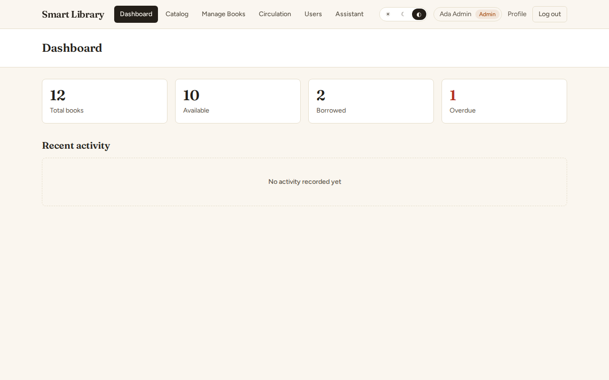
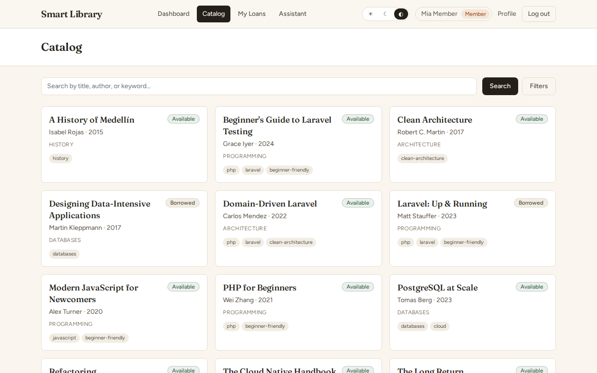
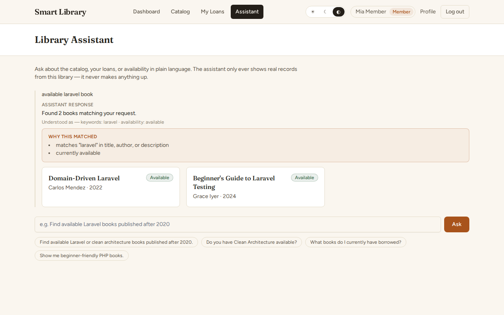
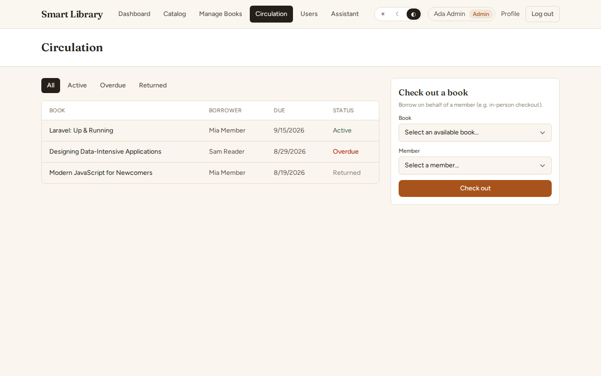
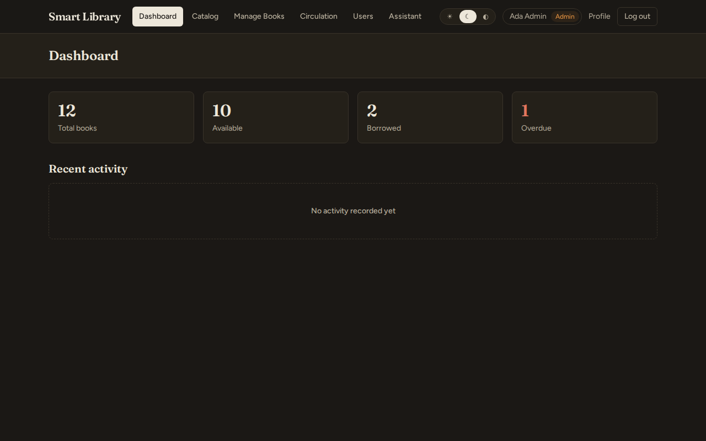
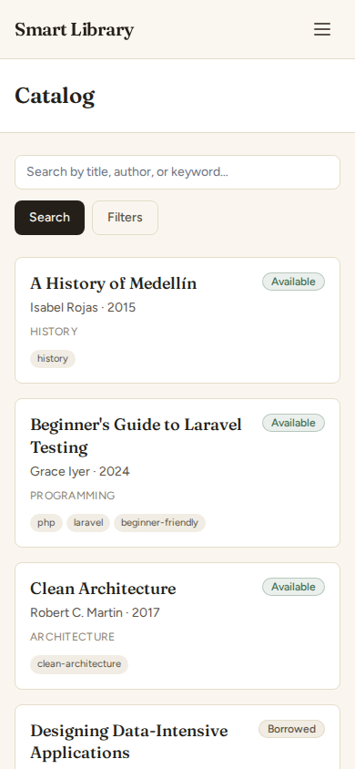

# Smart Library

A real library management system — catalog, borrow/return, role-based access, an event-driven audit trail, and a grounded natural-language Library Assistant that never invents a book.

## Overview

Built as a technical challenge submission demonstrating clean MVC/domain layering, SOLID-friendly service boundaries, transactional/concurrency-safe business rules, and a scoped, non-overengineered application of hexagonal architecture where it actually earns its keep (the AI provider boundary) rather than everywhere. Full write-up in `ARCHITECTURE.md`.

**Live Demo:** **https://smart-library-zsh8.onrender.com**
**Source:** https://github.com/alejo21ny/smart-library-challenge

> Deployed on Render's free tier for this submission — the web service cold-starts after idle periods (the first request can take tens of seconds) and the free Postgres instance is time-limited. See `docs/DEPLOYMENT.md` for the full deployment model, including the documented AWS ECS/Fargate alternative.

## Demo accounts

| Role | Email | Password |
|---|---|---|
| Admin | `admin@example.test` | `password` |
| Librarian | `librarian@example.test` | `password` |
| Member | `member@example.test` | `password` |

The live login screen has a "Demo access" panel that fills these in for you. Documented demo-only credentials for reviewer convenience — never reused for anything real.

## Screenshots

| | |
|---|---|
|  Admin dashboard |  Catalog |
|  Library Assistant |  Circulation (staff) |
|  Dark mode |  Mobile |

More screenshots (login, book detail) are in `docs/screenshots/`.

## Terminology note

The original assignment text used "checked in" / "checked out" ambiguously. This product uses explicit, unambiguous language instead: **actions** `BORROW BOOK` / `RETURN BOOK`, **book states** `AVAILABLE` / `BORROWED`. Full rationale in `ARCHITECTURE.md`.

## Core Features

**Catalog** — paginated, PostgreSQL full-text search (title/author/description) with a typo-tolerant fallback (see "Smart Library Assistant" below), filterable by ISBN/author/category/tag/availability, sortable.

**Books** (Librarian/Admin) — create, edit, delete, view: title, author, ISBN, description, category, tags, publication year, optional cover URL. Delete asks for confirmation via an in-app dialog, not a browser popup.

**Loans** — borrow/return with a configurable default loan period (`LIBRARY_LOAN_PERIOD_DAYS`, default 14 days), overdue detection, per-member history. A book can never be double-borrowed — enforced by a PostgreSQL partial unique index *and* a locked transaction, not just application logic.

**Audit trail** — every book create/update/delete, borrow/return, and role change is recorded via domain Events + one Listener (not scattered manual inserts), and surfaced as a human-readable "Recent activity" feed on the staff dashboard, gated to Admin/Librarian.

**UI** — light/dark/system theme, responsive desktop/tablet/mobile (including a card layout for book management on small screens, not a horizontally-scrolling table), `prefers-reduced-motion` support, keyboard-accessible forms.

## Roles & Permissions

`ADMIN` / `LIBRARIAN` / `MEMBER`, enforced server-side via Laravel Policies and route middleware — never just hidden in the UI. This is a **self-service** library: members borrow/return their own books directly; librarians/admins can additionally act on behalf of any user (in-person checkouts, corrections) and manage the catalog. Only Admins manage user accounts/roles. Full permission matrix in `ARCHITECTURE.md`.

Sign-in options:
- **Demo accounts** (above) — always available, no setup, works for any reviewer.
- **Google SSO** — implemented and verified working in production. A new Google sign-in is always created as `MEMBER`; role elevation never comes from Google, ever. A verified-email flag is only trusted when Google's own `email_verified` claim comes back `true` for that exact account. **The Google OAuth app is currently in Google's "Test" publishing mode**, so Google sign-in only works for authorized test users added to that OAuth app — it is not yet available to an arbitrary Google account. Every reviewer can always use the seeded demo accounts above regardless.

## Smart Library Assistant

A grounded natural-language assistant over the real catalog and loan data — not a chatbot with a generic language model bolted on:

- Ask in plain language: *"Do you have Clean Architecture available?"*, *"What books do I currently have borrowed?"*, or (staff) *"Give me a quick circulation summary"*.
- A deterministic action router decides *what kind* of question it is — catalog search, availability check, your loans, or a staff-only circulation summary — then runs a real, read-only query against the actual database. Every book, loan, and count shown comes from a real row. **It never invents a book that doesn't exist.**
- Fuzzy, typo/word-order tolerant catalog discovery: `arquitecture clea` still finds *Clean Architecture*, via a PostgreSQL trigram similarity fallback when the strict full-text search comes up empty.
- **No external AI model is configured in this deployment.** The assistant runs entirely on its deterministic fallback in production right now — full search/availability/loans/summary functionality, zero external calls. The codebase includes a provider abstraction (`AiProviderInterface`) that supports plugging in an OpenAI-Chat-Completions-compatible endpoint to improve the phrasing of a grounded answer; that capability is implemented and tested, but no key is configured here, so it is not currently active. Either way, the tool surface is read-only — there is no borrow/return/delete path reachable through the Assistant.

## Architecture

See `ARCHITECTURE.md` for the domain model, availability's single source of truth, concurrency design, the RBAC/events/audit architecture, the Assistant's tool architecture and grounding guarantees, and deployment architecture.

## Security

See `SECURITY.md` for threat boundaries, CSRF, OAuth role handling, secret handling, the AI prompt/tool boundary, rate limiting, and safe logging.

## Testing

```bash
docker compose exec laravel.test php artisan test                                   # Pest
docker compose exec laravel.test ./vendor/bin/pint --test                            # code style (drop --test to auto-fix)
docker compose exec laravel.test ./vendor/bin/phpstan analyse --memory-limit=1G      # static analysis (Larastan, level 5)
npm run lint          # ESLint, check-only
npm run typecheck     # tsc --noEmit
npm run format:check  # Prettier, check-only
npm run build          # TypeScript + Vite production build
npm run test:e2e       # Playwright — see tests/e2e/
```

Current status: **93 Pest tests passing (339 assertions)** · Pint clean (117 files) · Larastan (level 5) clean · ESLint clean · typecheck clean · Prettier clean · production frontend build clean · **13/13 Playwright E2E tests passing**, covering admin/member login, dashboard, book create/edit, catalog search, borrow, double-borrow rejection, return, role-based 403, the Assistant's deterministic and fuzzy-query behavior, light/dark theme, and mobile navigation. All of this runs on every push via GitHub Actions CI (`.github/workflows/ci.yml`) — backend, frontend, and E2E as three independent jobs.

Domain coverage (Pest): book CRUD, search by title/author/ISBN, availability/category filtering, borrow/return/due-dates/overdue, double-borrow rejection at both the app and database level, all three roles' permissions, the audit trail, the Assistant's deterministic fallback + fuzzy matching + tool routing + its guarantee that it never returns a nonexistent book, Google SSO (button visibility, new-user-is-always-MEMBER, account linking, email-verification handling, safe-when-unconfigured), reverse-proxy HTTPS handling, and the observability endpoints.

## Local Setup (verified on Windows)

```bash
# 1. Copy the environment file
cp .env.example .env
# Windows (non-WSL2) only: also set WWWUSER=1000 and WWWGROUP=1000 in .env.

# 2. Install PHP dependencies
docker run --rm -v "$(pwd):/app" -w /app composer:2 install

# 3. Generate the application key
docker run --rm -v "$(pwd):/app" -w /app composer:2 php artisan key:generate

# 4. Install frontend dependencies and build
npm install
npm run build

# 5. Start the containers (PHP app + PostgreSQL)
docker compose up -d --build

# (Windows/non-WSL2 only) storage/ and bootstrap/cache/ need to be writable
# by the container's non-root user on a bind mount:
docker compose exec laravel.test bash -c "chmod -R ugo+rwX storage bootstrap/cache"

# 6. Run migrations and seed realistic demo data
docker compose exec laravel.test php artisan migrate --seed --seeder=DemoSeeder
```

The app is now at **http://localhost**. Stop everything with `docker compose down`.

**Note on Laravel Sail on Windows:** `./vendor/bin/sail`'s wrapper script only supports macOS/Linux/WSL2 — it refuses to run on plain Git Bash/MSYS. This project was built and verified using `docker compose` directly against Sail's own `compose.yaml`. On WSL2/macOS/Linux, `./vendor/bin/sail ...` works as a shorter alias for the `docker compose exec laravel.test ...` commands above.

To try Google SSO or a real AI provider locally, set `GOOGLE_CLIENT_ID`/`GOOGLE_CLIENT_SECRET`/`GOOGLE_REDIRECT_URI` or `AI_PROVIDER`/`AI_BASE_URL`/`AI_API_KEY`/`AI_MODEL` in `.env` — see `.env.example`. Both are fully optional; the app works completely without either.

## Deployment

Live on Render (free tier) at the URL above. See `docs/DEPLOYMENT.md` for the full deployment model — environment variables, HTTPS/reverse-proxy handling, migration/seeding strategy, free-vs-paid tier tradeoffs, and the documented AWS ECS/Fargate + RDS alternative.

## Documentation

- `ARCHITECTURE.md` — domain model, layering, concurrency, Assistant tool architecture, deployment architecture
- `SECURITY.md` — threat boundaries, OAuth role handling, secret handling, AI boundary, rate limiting
- `docs/DEPLOYMENT.md` — the executed Render deployment, environment variables, the AWS alternative
